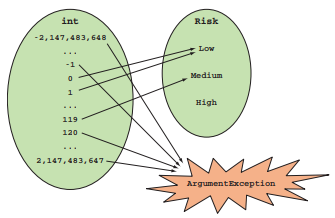
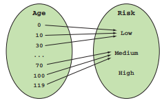

Chapter 3-Function Signature, Void and Unit
==============================

Let's say you're in the business of life insurance. You need to write a function that calculates a customer's risk profile based on their age:

```C#
public enum Risk 
{ 
   Low, 
   Medium, 
   High 
}
```

and you might write code like:

```C#
public Risk CalculateRiskProfile(int age)
{
   return (age < 60) ? Risk.Low : Risk.Medium;
}

Risk a = CalculateRiskProfile(30);  // a is Low
Risk b = CalculateRiskProfile(70);  // b is Medium
```
but there is an underlying issue, if you do:

```C#
// clearly, these are not valid values for a customer's age
Risk a = CalculateRiskProfile(-1000);  
Risk b = CalculateRiskProfile(10000); 
```

then you add some validations:

```C#
public Risk CalculateRiskProfile(int age) 
{
   if (age < 0 || age > 120)
      throw new ArgumentException($"{age} is not a valid age");

   return (age < 60) ? Risk.Low : Risk.Medium;
}

CalculateRiskProfile(10000)  // runtime error: 10000 is not a valid age
```

There is still some annoying side effects:

1. You have to write additional unit tests for the cases in which validation fails.

2. Code duplication. There are other areas of the application where an age is expected, so you need to add this validation there (in every methods that takes Age) as well.


## Constraining Inputs with Custom Types

```C#
// better, but not perfect
public struct Age 
{
   public int Value { get; }

   public Age(int value) 
   {
      if (!IsValid(value))
         throw new ArgumentException($"{value} is not a valid age");  // validating the age value is captured in the constructor which can be reused
      Value = value;
   }

   private static bool IsValid(int age) {
      return 0 <= age && age < 120;
   }
}

// the Age's constructor ensures that the Age type can only be instantiated with a valid value, so you don't need to validate inside the method
// so you're guaranteeing that only valid values can be given in CalculateRiskProfile methods
public Risk CalculateRiskProfile(Age age) {
   return age.Value < 60 ? Risk.Low : Risk.Medium;
}
```

There are still some potential problem in this new implementation:

* Reading the Value property not only creates a bit of noise, `age.Value < 60` let client code know the internal representation of `Age`, which you might change in the future

* what if the developer has a typo `age.Value < 600`?

You can have a better solution as below:

```C#
public struct Age   // good design
{
   private int Value { get; }  // <--------------------Value property is private now

   public Age(int value)
   {
      if (!IsValid(value))
         throw new ArgumentException($"{value} is not a valid age");

      Value = value;
   }

   private static bool IsValid(int age) => 0 <= age && age < 120;

   public static bool operator <(Age a, Age b) => a.Value < b.Value;
   public static bool operator >(Age a, Age b) => a.Value > b.Value;
   public static bool operator ==(Age a, Age b) => a.Value == b.Value;

   public static bool operator <(Age a, int i) => a < new Age(i);  // note that it can't be `a.Value < i`, because you want to use the constructor to do the validation
   public static bool operator >(Age a, int i) => a > new Age(i);
   public static bool operator ==(Age a, int i) => a > new Age(i);

   public override string ToString() => Value.ToString();
}

public Risk CalculateRiskProfile(Age age) 
{
   return age < 60 ? Risk.Low : Risk.Medium;
}
```


## Writing Honest Functions

so what's fundamentally wrong with this function:

```C#
Risk CalculateRiskProfile(int age) {
   if (age < 0 || 120 <= age)
      throw new ArgumentException($"{age} is not a valid age");
   return (age < 60) ? Risk.Low : Risk.Medium;
}
```
We can method above is **dishonest** becuase the function itself says : *Give me an int, and I may return a Risk, or I may throw an exception instead*"*.



What we want to have is a **honest** function which should give us: *Give me an Age, and I will give you back a Risk", this also indicates that honest functions should not return `null`*.



In summary, a function is honest if its behavior can be predicted by its signature:

1. It returns a value of the declared type
2. It doesn't throw exceptions
3. It never returns null


##  Why `Void` isn't Ideal

```C#
public static class InstrumentationDuplicatedLogic
{
   public static T Time<T>(string op, Func<T> f)
   {
      var sw = new Stopwatch();
      sw.Start();
      T t = f();
      sw.Stop();
      Console.WriteLine($"{op} took {sw.ElapsedMilliseconds}ms");
      return t;
   }

   public static void Time(string op, Action act)
   {
      var sw = new Stopwatch();
      sw.Start();
      act();
      sw.Stop();
      Console.WriteLine($"{op} took {sw.ElapsedMilliseconds}ms");
   }
}

var contents = Instrumentation.Time("reading from file.txt", () => File.ReadAllText("file.txt"));

Instrumentation.Time("writing to file.txt", () => File.AppendAllText("file.txt", "New content", Encoding.UTF8));  // AppendAllText return void
```

You can see that the second Time fucntion is almost the same as the first one, there is a lot of duplicated code just because the difference function parameter between `Func<T>` and `Action` which is a requirement by `File.AppendAllText()`


## Bridging the Gap Between `Action` and `Func`

If you're going to use functional programming, it's useful to have a different representation for *no return value*. Instead of using `void`, we use a special value, the empty tuple `System.ValueTuple` (also called **Unit**):

```C#
//----------------------V
public struct ValueTuple : IEquatable<ValueTuple>, IStructuralComparable, IComparable, IComparable<ValueTuple> 
{  
   // contains no member

   public bool Equals(ValueTuple other) {  // two ValueTuple instances are always the same
       return true;
   }

   bool IStructuralEquatable.Equals(object? other, IEqualityComparer comparer) {
       return other is ValueTuple;
   }

   public int CompareTo(ValueTuple other) {
       return 0;
   }

   int IComparable.CompareTo(object? other) {
      if (other is null) return 1;

      if (other is not ValueTuple) {
         ThrowHelper.ThrowArgumentException_TupleIncorrectType(this);
      }

      return 0;
   }

   int ITuple.Length => 0;  // because ValueTuple contains no member

   public override int GetHashCode() {
       return 0;
   }

   public override string ToString() {
      return "()";
   }

   // ...

   public static ValueTuple Create() => default;

   public static ValueTuple<T1> Create<T1>(T1 item1) => new ValueTuple<T1>(item1);

   public static ValueTuple<T1, T2> Create<T1, T2>(T1 item1, T2 item2) => new ValueTuple<T1, T2>(item1, item2);
   // ...
   public static ValueTuple<T1, T2, T3, T4, T5, T6, T7> Create<T1, T2, T3, T4, T5, T6, T7>(T1 item1, T2 item2, T3 item3, T4 item4, T5 item5, T6 item6, T7 item7) =>
      new ValueTuple<T1, T2, T3, T4, T5, T6, T7>(item1, item2, item3, item4, item5, item6, item7);
   
   public static ValueTuple<T1, T2, T3, T4, T5, T6, T7, ValueTuple<T8>> Create<T1, T2, ..., T7, T8>(T1 item1, T2 item2, ... T7 item7, T8 item8) =>
      new ValueTuple<T1, T2, T3, T4, T5, T6, T7, ValueTuple<T8>>(item1, item2, item3, item4, item5, item6, item7, ValueTuple.Create(item8));
}
//----------------------Ʌ

//------------------------------V
public struct ValueTuple<T1, T2> : IEquatable<ValueTuple<T1, T2>>, IStructuralEquatable, IComparable, IComparable<ValueTuple<T1, T2>>, ITuple ...
{
   public T1 Item1;

   public T2 Item2;

   public ValueTuple(T1 item1, T2 item2) {
      Item1 = item1;
      Item2 = item2;
   }

   public bool Equals(ValueTuple<T1, T2> other) {
      return EqualityComparer<T1>.Default.Equals(Item1, other.Item1) && EqualityComparer<T2>.Default.Equals(Item2, other.Item2);
   }

   // ...
}
//------------------------------Ʌ
```

In FP, we normally give it a name with **Unit** as:

```C#
using Unit = System.ValueTuple;
```

Technically, `void` and `Unit` differ in that:

* `void` is a type that represents an empty set; as such, it's not possible to create an instance of it
* `Unit` represents a set with a single value; as such, any instance of `Unit` is equivalent to any other, therefore, carries no information

Now let's use `Unit` to remove the duplicated logic:

```C#
namespace LaYumba.Functional;

public static class ActionExt
{
   public static Func<Unit> ToFunc(this Action action) => () => { action(); return default; };  // default is equivalent to `default(Unit)` or `default(ValueTuple)`

   public static Func<T, Unit> ToFunc<T>(this Action<T> action) => (t) => { action(t); return default; };
}
```

then you can do:

```C#
//good code
public static class Instrumentation
{
   public static Unit Time(string op, Action act) => Time<Unit>(op, act.ToFunc());

   public static T Time<T>(string op, Func<T> f)
   {
      var sw = new Stopwatch();
      sw.Start();
      T t = f();
      sw.Stop();
      Console.WriteLine($"{op} took {sw.ElapsedMilliseconds}ms");
      return t;
   }
}

// bad code
// compared with the previous duplicated one
public static class InstrumentationDuplicatedLogic {
   public static T Time<T>(string op, Func<T> f) {
      var sw = new Stopwatch();
      sw.Start();
      T t = f();
      sw.Stop();
      Console.WriteLine($"{op} took {sw.ElapsedMilliseconds}ms");
      return t;
   }

   public static void Time(string op, Action act) {
      var sw = new Stopwatch();
      sw.Start();
      act();
      sw.Stop();
      Console.WriteLine($"{op} took {sw.ElapsedMilliseconds}ms");
   }
}
```