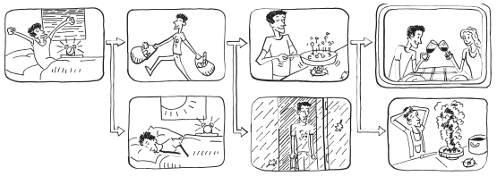

Chapter 8-Functional Error Handling
==============================

* Imperative programming uses special statement like `throw` and `try-catch`, which disrupts the normal program flow. This introduces side effects as discussed before.

* Functional programming strives to minimize side effects, so throwing exceptions is generally avoided. Instead, if an operation fails, it should return a representation of its outcome, including an indication of success or failure, as well as its result(if successful) or some error data otherwiese. In other words, errors in FP are just payload.

In some scenarios, `Option` is too limited because it doesn't convey any details about why an operation has failed as `Option` can only indicate "successful" or "failed":

|-----------------|  Failure  | Success   |
|  `Option<T>`    |  `None`   | `Some<T>` |
| `Either<L, R>`  |  `Left<L>`| `Right<R>`|

Imagine we're modeling a recruitment process. We'll start with an Option-based implementation in which Some(Candidate) represents a candidate that has passed the interview process so far, whereas None represents rejection:

```C#
Func<Candidate, bool> IsEligible;
Func<Candidate, Option<Candidate>> Interview;
Func<Candidate, Option<Candidate>> TechTest;

Option<Candidate> Recruit(Candidate c)
   => Some(c)
      .Where(IsEligible)  
      .Bind(Interview)
      .Bind(TechTest);
```
in the end we get an instance of `Option<Candidate>`, but if the candidate fails, we don't know which stage she fails

We need a richer way to represent what exactly has gone wrong by using `Either<L, R>`. Let's see how we can use `Either<L, R>`:

```C#
Func<Candidate, bool> IsEligible;
Func<Candidate, Either<Rejection, Candidate>> TechTest;
Func<Candidate, Either<Rejection, Candidate>> Interview;

Either<Rejection, Candidate> CheckEligibility(Candidate c)
{
   if (IsEligible(c)) 
      return c;
   else 
      return new Rejection("Not eligible");
}

Either<Rejection, Candidate> Interview(Candidate c)
{
   if (...) 
      return c;
   else 
      return new Rejection("Didn't pass interview");
}

Either<Rejection, Candidate> TechTest(Candidate c)
{
   if (...) 
      return c;
   else 
      return new Rejection("Didn't pass technical test");
}

Either<Rejection, Candidate> Recruit(Candidate c)
   => Right(c)
      .Bind(CheckEligibility)      
      .Bind(Interview)   // if she fails here, we know she didn't pass interview
      .Bind(TechTest);   // if she fails here, we know she dodn't pass technical test
```

more examples:

```C#
using LaYumba.Functional;
using static LaYumba.Functional.F;

Right(12)     // => Right(12)
Left("oops")  //=> Left("oops")

public string Render(Either<string, double> val) {
   return val.Match
   (
      Left: l => $"Invalid value: {l}",
      Right: r => $"The result is: {r}"
   );
}

Render(Right(12d));   // "The result is: 12"
Render(Left("oops"))  // "Invalid value: oops"
```

Image a function that performs `f(x, y) => sqrt(x / y)`, if you use OO approach, there will be exception need to be thrown when y is zero and x/y less than zero, with FP style`Either`, things become very easy and straightforward:

```C#
public Either<string, double> Calc(double x, double y)
{
   if (y == 0) 
      return "y cannot be 0";   

   if (x != 0 && Sign(x) != Sign(y))
      return "x / y cannot be negative";

   return Sqrt(x / y);
}

Calc(3, 0);    // => Left("y cannot be 0")
Calc(-3, 3);   // => Left("x / y cannot be negative")
Calc(-3, -3);  // => Right(1)
```



                 Bind                   Bind            Match
WakeUpEarly---->-ShopForIngredients--->-CookRecipe---->-EnjoyTogether
                |                     |               |
                |--------->-----------|------>--------|-OrderPizza

F# evangelist Scott Wlaschin likens a workflow obtained by chaining several Either-returning functions to a two-track system:

* There's a main track (the happy path), going from R1 to Rn
* There's an auxiliary, parallel track, on the Left side
* If you're on the Right track, with each function application, you will either proceed along the Right track or be diverted to the Left track
* Once you're on the Left track, you stay on it until the end of the road
* `Match` is the end of the road, where the disjunction of the parallel tracks takes place

for the third point, we can see from the code, `Bind` can return a L type in two scecerios:

```C#
public static Either<L, RR> Bind<L, R, RR>(this Either<L, R> either, Func<R, Either<L, RR>> f)
{
   return either.Match   // the return Either<L, RR> can have Left in two scenerio, 1. when itself is Left or 2. f(r) is Left
   (
      l => Left(l),      // return L when the argument either is Left
      r => f(r)          // might also return L if f(r) ia L
   );
}
```

Let's see how we can use `Either<L, R>` for validation purpose in our BOC application

Define the Error message that we can use:

```C#
public static class Errors
{
   public static Error InsufficientBalance
      => new InsufficientBalanceError();

   public static Error InvalidBic
      => new InvalidBicError();

   // ...
}

public rec൦rd Error(string Message);

public sealed record InvalidBicError() : Error("The beneficiary's BIC/SWIFT code is invalid");

public sealed record InsufficientBalanceError() : Error("Insufficient funds to fulfil the requested operation");

public sealed record CannotActivateClosedAccountError() : Error("Cannot activate an account that has been closed");

public sealed record TransferDateIsPastError() : Error("Transfer date cannot be in the past");

// ...
```

## Either-based API for BOC

```C#
public class MakeTransferController : ControllerBase
{
   // no need to define OO style interfaces
   // private IValidator<MakeTransfer> validator;
   private DateTime now;
   private Regex bicRegex = new("[A-Z]{11}");

   [HttpPost]
   [Route("transfers/book")]
   public IActionResult MakeTransfer([FromBody] MakeTransfer transfer)
      => Handle(transfer).Match<IActionResult>
      (
         Left: BadRequest,  // return 404
         Right: _ => Ok()   // return 200
      );

   private Either<Error, Unit> Handle(MakeTransfer transfer)
      => Right(transfer)      // <------------- this process will be breakdown into detials, see Q1
         .Bind(ValidateBic)   // this Bind is from Either.Right's Bind, this is important, the first Bind after Right is Either.Right's Bind
         .Bind(ValidateDate)  // this Bind is from Either's Bind, all the Bind including this one and after are from Either's Bind
         .Bind(Save);

   private Either<Error, MakeTransfer> ValidateBic(MakeTransfer transfer)
      => bicRegex.IsMatch(transfer.Bic)
         ? transfer
         : Errors.InvalidBic;

   private Either<Error, MakeTransfer> ValidateDate(MakeTransfer transfer)
      => transfer.Date.Date > now.Date
        ? transfer
        : Errors.TransferDateIsPast;

   private Either<Error, Unit> Save(MakeTransfer cmd)
   {
      if (...)
         return Unit.Create();   // Unit is System.ValueTuple, so it is like `ValueTuple.Create()`
      else
         return Errors.UnexpectedError;
   }
}
```

Instead of trying to figure out which HTTP status code best suits a particular error scenario, another approach is to return a representation of the outcome in the
response, so the error can be serializated as JSON payload:

```C#
public record ResultDto<T>
{
   public bool Succeeded { get; }
   public bool Failed => !Succeeded;
   public T Data { get; }
   public Error Error { get; }
   internal ResultDto(T data) => (Succeeded, Data) = (true, data);
   internal ResultDto(Error error) => Error = error;
}

public static ResultDto<T> ToResult<T>(this Either<Error, T> either) 
{
   return either.Match
   (
      Left: error => new ResultDto<T>(error),
      Right: data => new ResultDto<T>(data)
   );
}

public class MakeTransferController : ControllerBase
{
   private DateTime now;
   private Regex bicRegex = new("[A-Z]{11}");

   [HttpPost]
   [Route("transfers/book")]
   public ResultDto<Unit> MakeTransfer([FromBody] MakeTransfer transfer)
      => Handle(transfer).ToResult();

   private Either<Error, Unit> Handle(MakeTransfer transfer)
      => Right(transfer)      
         .Bind(ValidateBic)  
         .Bind(ValidateDate)
         .Bind(Save);

   private Either<Error, MakeTransfer> ValidateBic(MakeTransfer transfer)
      => bicRegex.IsMatch(transfer.Bic)
         ? transfer
         : Errors.InvalidBic;

   private Either<Error, MakeTransfer> ValidateDate(MakeTransfer transfer)
      => transfer.Date.Date > now.Date
         ? transfer
         : Errors.TransferDateIsPast;

   private Either<Error, Unit> Save(MakeTransfer cmd)
   {
      if (...)
         return Unit.Create(); 
      else
         return Errors.UnexpectedError;
   }
}
```

##  Specialized versions of Either

Let's look at the other shortcomings of using `Either<L, R>` in C#.

Firstly, it adds some noise as you need to read a lot of things. For example: `public Either<IEnumerable<Error>, Rates> RefreshRates(string id)`, you have to read `Either`, `IEnumerable`, and `Error` and then desired return type Rates

Secondly, the names `Either`, `Left`, and `Right` are too abstract. 

So we introduces two variants of `Either`: `Validation<T>` and `Exceptional<T>`:

|       Type        |  Failure     | Success |  Failure type
|  `Either<L, R>`   |  `Left`      | `Right` |  `L`
|  `Validation<T>`  |  `Invalid`   |  `T`    |  `IEnumerable<Error>`
|  `Exceptional<T>` |  `Exception` |  `T`    |  `Exception` (which is `System.Exception`)

Note that failed validation and technical errors should be handled differently as they have distinct semantic meaning:

* `Validation` denotes possible business rule violations
* `Exceptional` denotes possible unexpected technical errors


## Specialized Either API for BOC

```C#
[ApiController]
[Route("[controller]")]
public class MakeTransferController : ControllerBase
{
   private DateTime now;
   private Regex bicRegex = new("[A-Z]{11}");

   private ILogger<MakeTransferController> logger;

   [HttpPost]
   [Route("transfers/book")]
   public IActionResult MakeTransfer([FromBody] MakeTransfer transfer)
     => Handle(transfer).Match<IActionResult>   // IActionResult cannot be inferred, since it has a "nested" structure `result.Match`, check the source code in VS you will see
     (
        Invalid: BadRequest,   // Validation's IEnumerable<Error> is passed as an argument to BadRequest(object error)
        Valid: result => result.Match           // unless you use Match<IActionResult> here, you will need first one above
        (
           OnFaulted,
           _ => Ok()  // _ is Unit
        )
     );

   private IActionResult OnFaulted(Exception ex)
   {
      logger.LogError(ex.Message);
      return StatusCode(500, Errors.UnexpectedError);
   }

   private Validation<Exceptional<Unit>> Handle(MakeTransfer transfer)  // <------------Validation<Exceptional<Unit>> can be confusing, check V1 section for details
      => Validate(transfer)                                             // if Validation<Exceptional<Unit>> is IEnumerable<Error> internally, that means one of ValidateXXX fails
         .Map(Save);                                                    // if Validation<Exceptional<Unit>> is Exceptional<Unit>, it could be 1. Normal (return Unit) 2. Exception 
                                                                                                                                            
   private Validation<MakeTransfer> Validate(MakeTransfer transfer)   // Top-level validation function combining various validation rules
      => ValidateBic(transfer)
         .Bind(ValidateDate);   // only have two Validate fucntions here, could be more if in a real application
       //.Bind(ValidateXXX); 
       //.Bind(ValidateXXX); 

   private Validation<MakeTransfer> ValidateBic(MakeTransfer transfer)
    => bicRegex.IsMatch(transfer.Bic)
       ? transfer
       : Errors.InvalidBic;

   private Validation<MakeTransfer> ValidateDate(MakeTransfer transfer)
      => transfer.Date.Date > now.Date
         ? transfer
         : Errors.TransferDateIsPast;

   private Exceptional<Unit> Save(MakeTransfer cmd)
   {
      try
      {
         ConnectionHelper.Connect(connString, c => c.Execute("INSERT ...", transfer));   // make try-catch as small as possible
      }
      catch (Exception ex)
      {
         return ex;
      }

      return Unit.Create();
   }
}
```

As a library developer, we still need to throw `Exception` in some scenarios. For example, if users are trying to remove an item from an empty list/data structure you implemented (same as Dapper library above also throws an exception). What we sometimes as application developers need to do is, avoid using try-catch to discrupt execution flow, instead aplication developers should use Either/Exceptional based FP approach to maintain the execution flow.
 
 Q1-How can someting starts with `Right` then finally get converted to `Either`

 ```C#
 private Either<Error, Unit> Handle(MakeTransfer transfer)
    => Right(transfer)
       .Bind(ValidateBic)    // this Bind is from Either.Right Bind
       .Bind(ValidateDate)   // this Bind is from Either Bind
       .Bind(Save);
```

if you look at the source code of `Right`:

```C#
public static partial class F
{
   //public static Either.Left<L> Left<L>(L l) => new Either.Left<L>(l);
   public static Either.Right<R> Right<R>(R r) => new Either.Right<R>(r);
}

// public struct Left<L> { ... }

public struct Right<R>
{
   internal R Value { get; }

   internal Right(R value) { Value = value; }

   public override string ToString() => $"Right({Value})";

   public Right<RR> Map<L, RR>(Func<R, RR> f) => Right(f(Value));

   public Either<L, RR> Bind<L, RR>(Func<R, Either<L, RR>> f) => f(Value); 
}
```

So `Right` has no knowledge of L (`Error` in this example), how does it finally get converted to `Either<Error, Unit>`.
It is because of first `Bind` function in `Right(...).Bind()` that "give" Right a L type


## Exercise

1. Write a ToOption extension method to convert an Either into an Option; if present, the left value is thrown away. Then write a ToEither method to convert an Option into an Either with a suitable parameter that can be invoked to obtain the appropriate Left value if the Option is None. 

```C#
public static class ExerciseExtension
{
   public static Option<R> ToOption<L, R>(this Either<L, R> either)
   {
      return either.Match(l => None, r => Some(r));
   }

   public static Either<L, R> ToEither<L, R>(this Option<R> option, Func<L> left)
   {
      return option.Match<Either<L, R>>(() => left(), r => r);
   }
}
```

2. Write a function with the signature `TryRun : (() → T) → Exceptional<T>`

```C#
public static Exceptional<T> TryRun<T>(Func<T> func)
{
   try
   {
      return func();
   }
   catch (Exception ex)
   {
      return ex;
   }
}
```


## Source Code


```C#
// Either
public static partial class F
{
   public static Either.Left<L> Left<L>(L l) => new Either.Left<L>(l);
   public static Either.Right<R> Right<R>(R r) => new Either.Right<R>(r);
}

public struct Either<L, R>
{
   private L? Left { get; }
   private R? Right { get; }

   private bool IsRight { get; }
   private bool IsLeft => !IsRight;

   internal Either(L left)
   {
      (IsRight, Left, Right) = (false, left ?? throw new ArgumentNullException(nameof(left)), default);
   }

   internal Either(R right)
   {
      (IsRight, Left, Right) = (true, default, right ?? throw new ArgumentNullException(nameof(right)));
   }

   public static implicit operator Either<L, R>(L left) => new Either<L, R>(left);
   public static implicit operator Either<L, R>(R right) => new Either<L, R>(right);

   public static implicit operator Either<L, R>(Either.Left<L> left) => new Either<L, R>(left.Value);
   public static implicit operator Either<L, R>(Either.Right<R> right) => new Either<L, R>(right.Value);

   public TR Match<TR>(Func<L, TR> Left, Func<R, TR> Right)
   {
      return IsLeft ? Left(this.Left!) : Right(this.Right!);
   }
}

public static class Either
{
   public struct Left<L>
   {
      internal L Value { get; }

      internal Left(L value) { Value = value; }

      public override string ToString() => $"Left({Value})";

      // no need of Map and Bind
   }

   public struct Right<R>
   {
      internal R Value { get; }

      internal Right(R value) { Value = value; }

      public override string ToString() => $"Right({Value})";

      public Right<RR> Map<RR>(Func<R, RR> f) => Right(f(Value));

      public Either<L, RR> Bind<L, RR>(Func<R, Either<L, RR>> f) => f(Value);   // R and RR can be the same
   }
}

// Either related Map, Bind
public static class EitherExtension
{
   public static Either<L, RR> Map<L, R, RR>(this Either<L, R> either, Func<R, RR> f)
   {
      return either.Match<Either<L, RR>>
      (
         l => Left(l),
         r => Right(f(r))
      );
   }

   public static Either<LL, RR> Map<L, LL, R, RR>(this Either<L, R> either, Func<L, LL> Left, Func<R, RR> Right)
   {
      return either.Match<Either<LL, RR>>
      (
         l => F.Left(Left(l)),
         r => F.Right(Right(r))
      );
   }

   public static Either<L, RR> Bind<L, R, RR>(this Either<L, R> either, Func<R, Either<L, RR>> f)   // note that you cannot change L to LL
   {
      return either.Match
      (
         l => Left(l),
         r => f(r)
      );
   }

   public static Either<L, Unit> ForEach<L, R>(this Either<L, R> either, Action<R> act)
   {
      return Map(either, act.ToFunc());
   }

   // Either doesn't have Where method, because only type like Option that has "zero" type (NoneType in Option) can have Where
   // public static Either<L, R> Where<L, R>(this Either<L, R> either, Func<R, bool> predicate)
   // {
   //   return either.Match
   //   (
   //      l => Left(l),
   //      r => predicate(r) : Right(r) ? Left(/* now what? I don't have an L as "zero" type*/)
   //   );
   // }
}
```

```C#
// Validation, a specialized variant of Either
public static partial class F
{
   public static Validation<T> Valid<T>(T value)
      => new(value ?? throw new ArgumentNullException(nameof(value)));

   // create a Validation in the Invalid state
   public static Validation.Invalid Invalid(params Error[] errors) => new(errors);  // <----------why we need this? maybe fits scenario when T cannot be determined in advance?
   public static Validation<T> Invalid<T>(params Error[] errors) => new Validation.Invalid(errors);
   public static Validation.Invalid Invalid(IEnumerable<Error> errors) => new(errors);
   public static Validation<T> Invalid<T>(IEnumerable<Error> errors) => new Validation.Invalid(errors);
}

public struct Validation<T>
{
   internal IEnumerable<Error> Errors { get; }   // Left, not sure why we need IEnumerable<Error> when we only use single Error
   internal T? Value { get; }                    // Right

   public bool IsValid { get; }

   public static Validation<T> Fail(IEnumerable<Error> errors)
      => new(errors);

   public static Validation<T> Fail(params Error[] errors)
      => new(errors.AsEnumerable());

   private Validation(IEnumerable<Error> errors)
      => (IsValid, Errors, Value) = (false, errors, default);

   internal Validation(T t)
      => (IsValid, Errors, Value) = (true, Enumerable.Empty<Error>(), t);

   public static implicit operator Validation<T>(Error error)    // Single Error
      => new Validation<T>(new[] { error });

   public static implicit operator Validation<T>(Validation.Invalid left)  // IEnumerable<Error>
      => new Validation<T>(left.Errors);

   public static implicit operator Validation<T>(T right) => Valid(right);

   public R Match<R>(Func<IEnumerable<Error>, R> Invalid, Func<T, R> Valid)
      => IsValid ? Valid(this.Value!) : Invalid(this.Errors);

   public Unit Match(Action<IEnumerable<Error>> Invalid, Action<T> Valid)
      => Match(Invalid.ToFunc(), Valid.ToFunc());

   public IEnumerator<T> AsEnumerable()
   {
      if (IsValid) yield return Value!;
   }

   // ...
}

public static class Validation
{
   public struct Invalid
   {
      internal IEnumerable<Error> Errors;
      public Invalid(IEnumerable<Error> errors) { Errors = errors; }
   }

   // There is no Valid struct, Validation can represent "Right"

   public static Validation<R> Map<T, R> (this Validation<T> @this, Func<T, R> f) 
   {
      return @this.Match
      (
         Valid: t => Valid(f(t)),   // if Validation<T> is valid then after Func<T, R>, Validation<R> is valid too
         Invalid: errs => Invalid(errs)
      );
   }

   public static Validation<R> Bind<T, R>(this Validation<T> val, Func<T, Validation<R>> f)
      => val.Match(
         Invalid: (err) => Invalid(err),
         Valid: (r) => f(r));   // unlike `Map` if Validation<T> is valid then after Func<T, Validation<R>>, Validation<R> can still be invalid
       
   public static Validation<Unit> ForEach<R>(this Validation<R> @this, Action<R> act)
      => Map(@this, act.ToFunc());

   public static Validation<T> Do<T>(this Validation<T> @this, Action<T> action)  // is used when you only care about apply action on T and you still want the original 
   {                                                                              // Validation<T> instance to be returned, check Chapter13 for its usage
      @this.ForEach(action);
      return @this;   // note @this is unchange, that's why the return type is Validation<T> rather than Validation<R>
   }  

   public static Validation<T> ToValidation<T>(this Option<T> opt, Error error)   // check chapter13 for its usage
      => opt.Match(
         () => Invalid(error),
         (t) => Valid(t));
}
```

```C#
// Exceptional, a specialized variant of Either
public static partial class F
{
   public static Exceptional<T> Exceptional<T>(T t) => new(t);
}

public struct Exceptional<T>
{
   private Exception? Ex { get; }
   private T? Value { get; }

   private bool IsSuccess { get; }
   private bool IsException => !IsSuccess;

   internal Exceptional(Exception ex)
   {
      IsSuccess = false;
      Ex = ex ?? throw new ArgumentNullException(nameof(ex));
      Value = default;
   }

   internal Exceptional(T value)
   {
      IsSuccess = true;
      Value = value ?? throw new ArgumentNullException(nameof(value));
      Ex = default;
   }

   public static implicit operator Exceptional<T>(Exception ex) => new(ex);
   public static implicit operator Exceptional<T>(T t) => new(t);

   public TR Match<TR>(Func<Exception, TR> Exception, Func<T, TR> Success)
      => this.IsException ? Exception(Ex!) : Success(Value!);

   public Unit Match(Action<Exception> Exception, Action<T> Success)
      => Match(Exception.ToFunc(), Success.ToFunc());

   public override string ToString()
      => Match(
         ex => $"Exception({ex.Message})",
         t => $"Success({t})");
}

public static class Exceptional
{
   public static Exceptional<RR> Map<R, RR>(this Exceptional<R> @this, Func<R, RR> f)
      => @this.Match
      (
         Exception: ex => new Exceptional<RR>(ex),
         Success: r => f(r)
      );

   public static Exceptional<Unit> ForEach<R>(this Exceptional<R> @this, Action<R> act)
      => Map(@this, act.ToFunc());

   public static Exceptional<RR> Bind<R, RR>(this Exceptional<R> @this, Func<R, Exceptional<RR>> f)
      => @this.Match
      (
         Exception: ex => new Exceptional<RR>(ex),
         Success: r => f(r)
      );

   // ...
}
```