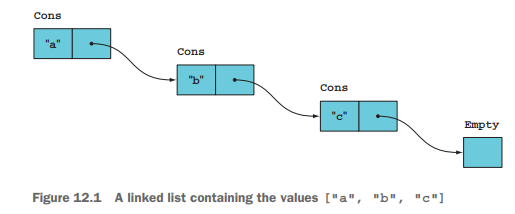
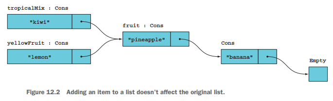
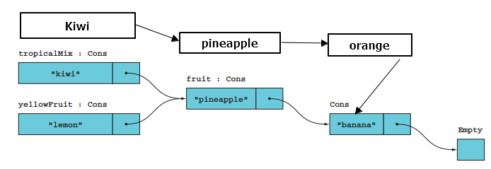
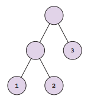
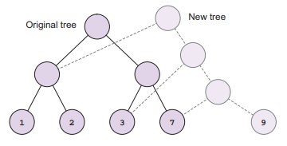

Chapter 11-Representing State and Change
=========================================

```C#
public static class Account  // <-----------------represent logic
{
   public static AccountState Create(CurrencyCode ccy) => new AccountState(ccy);

   public static AccountState Activate(this AccountState account) => account with { Status = AccountStatus.Active };

   public static AccountState Add(this AccountState account, Transaction trans)
   {
      return account with  // use `with` to shallow copy to a new instance and setup TransactionHistory
      {
         TransactionHistory = account.TransactionHistory.Prepend(trans)
      };
   }
}

public record AccountState(  // <-----------------represent state
   CurrencyCode Currency,
   AccountStatus Status = AccountStatus.Requested,
   decimal AllowedOverdraft = 0m,
   IEnumerable<Transaction> TransactionHistory = null
)
{
   // use a read-only property to disallow "updating" the currency of an account
   public CurrencyCode Currency { get; } = Currency;  // overwrite the default `get` and `init` property generated by the compiler

   // use a property initializer to use an empty list rather than null
   public IEnumerable<Transaction> TransactionHistory { get; init; }
      = TransactionHistory?.ToImmutableList()
         ?? Enumerable.Empty<Transaction>();
}

public struct CurrencyCode
{
   string Value { get; }
   public CurrencyCode(string value) => Value = value;

   public static implicit operator string(CurrencyCode c) => c.Value;
   public static implicit operator CurrencyCode(string s) => new(s);

   public override string ToString() => Value;
}

public rec൦rd Transaction
(
   decimal Amount,
   string Description,
   DateTime Date
);

public enum AccountStatus { Requested, Active, Frozen, Dormant, Closed }
```

In a nutshell, you use `record` to represent immutable objects (because of `record`'s `init` ), and for other internal fields such as `List<T>`, if you add a new element to the list you should return a new List that contains the new item and all existing items


## Functional Data Structures

You might ask isn't it very inefficient to "copy" all existing items to create a new list of items just to add/remove an item? The answer is, no, it is actually quite efficient. Let's look at some data structures you will see:

**LinkedList**

```C#
//-------------------------------------------------------------V
public abstract rec൦rd List<T>;
internal sealed rec൦rd Empty<T> : List<T>;
internal sealed rec൦rd Cons<T>(T Head, List<T> Tail) : List<T>;   // because of `init only`, you can't assign a different value to Head, that's what we want,
                                                                  // that's why we use `record` to achieve immutability
//-------------------------------------------------------------Ʌ

//----------------------------V
public static class LinkedList  // most of helper methods use recursion
{
   public static List<T> List<T>() => new Empty<T>();
   public static List<T> List<T>(T h, List<T> t) => new Cons<T>(h, t);
   public static List<T> List<T>(params T[] items)
   {
      return items.Reverse().Aggregate(List<T>(), (tail, head) => List(head, tail));
   }

   public static R Match<T, R>(this List<T> list, Func<R> Empty, Func<T, List<T>, R> Cons)
   {
      return list switch
      {
         Empty<T> => Empty(),
         Cons<T>(var t, var ts) => Cons(t, ts),
         _ => throw new ArgumentException("List can only be Empty or Cons")
      };
   }

   public static List<R> Map<T, R>(this List<T> list, Func<T, R> f)
   {
      return list.Match(() => List<R>(), (t, ts) => List(f(t), ts.Map(f)));
   }

   public static Acc Aggregate<T, Acc>(this List<T> list, Acc acc, Func<Acc, T, Acc> f)
   {
      return list.Match(() => acc, (t, ts) => Aggregate(ts, f(acc, t), f));
   }

   public static int Length<T>(this List<T> list)
   {
      return list.Match
      (
         () => 0,
         (_, tail) => tail.Length() + 1
      );
   }

   public static int Sum(this List<int> list) => list.Match(() => 0, (head, tail) => head + tail.Sum());

   public static List<T> Add<T>(this List<T> list, T value) => List(value, list);

   public static List<T> InsertAt<T>(this List<T> @this, int index, T value)  // check the figure below to see how it works
   {
      if (index == 0)
         return List(value, @this);
      else
         return @this.Match(() => throw new IndexOutOfRangeException(), (t, ts) => List(t, ts.InsertAt(index - 1, value)));
   }

   public static List<T> RemoveAt<T>(this List<T> @this, int index)
   {
      return @this.Match
      (
         () => throw new IndexOutOfRangeException(),
         (t, ts) => index == 0 ? ts : List(t, ts.RemoveAt(index - 1))  // check the figure below to see why it doesn't create new nodes
      );
   }
   
   public static List<T> Tail<T>(this List<T> list)
   {
      return list.Match(() => throw new IndexOutOfRangeException(), (_, tail) => tail);
   }

   public static List<T> TakeWhile<T>(this List<T> @this, Func<T, bool> pred)
   {
      return @this.Match
      (
         () => List<T>(),  // () => new Empty<T>() for readability
         (t, ts) => pred(t) ? List(t, ts.TakeWhile(pred)) : List<T>()  //
      );                                               // : new Empty<T>()
   }  // create new nodes when a node matches the predicate, because the next node might not match the predicate

   public static List<T> DropWhile<T>(this List<T> @this, Func<T, bool> pred)
   {
      return @this.Match
      (
         Empty: () => @this,
         Cons: (head, tail) => pred(head) ? tail.DropWhile(pred) : @this
      );
   }  // no List fucntion involved, i.e doesn't need to create new nodes like TakeWhile, it is like you "throw" away items that matches the predicate and when it stops
      // because of first item that that doesn't match the predicate, you just need the reference to the rest of linked list, that's why no new nodes need to be created
}
//----------------------------Ʌ
```

so if you do:

```C#
new Cons("a", new Cons("b", new Cons("c", Empty)));
```


```C#
List<string> fruit = List("pineapple", "banana");  // ["pineapple", "banana"]
List<string> tropicalMix = fruit.Add("kiwi");      // ["kiwi", "pineapple", "banana"]
List<string> yellowFruit = fruit.Add("lemon");     // ["lemon", "pineapple", "banana"]
```



if you add a new value (orange) in a specified index of a List, e.g between pineapple and banana in the example using the kiwi as the reference pass to the function, there will be
two new List instance created (a copy of kiwi, and a copy of pineapple), then those new instances will be linked together along with the new value




**Binary Tree**

```C#
//---------------------------------------------------------------V
public abstract rec൦rd Tree<T>;
internal rec൦rd Leaf<T>(T Value) : Tree<T>;  // only Leaf nodes contain values
internal rec൦rd Branch<T>(Tree<T> Left, Tree<T> Right) : Tree<T>;
//---------------------------------------------------------------Ʌ

public static class BinaryTree
{
   public static Tree<T> Leaf<T>(T Value) => new Leaf<T>(Value);

   public static Tree<T> Branch<T>(Tree<T> Left, Tree<T> Right) => new Branch<T>(Left, Right);

   public static R Match<T, R>(this Tree<T> tree, Func<T, R> Leaf, Func<Tree<T>, Tree<T>, R> Branch)
   {
      return tree switch
      {
         Leaf<T>(T val) => Leaf(val),
         Branch<T>(var left, var right) => Branch(left, right),
         _ => throw new ArgumentException("{tree} is not a valid tree")
      };
   }

   public static Acc Aggregate<T, Acc>(this Tree<T> tree, Acc acc, Func<Acc, T, Acc> f)
   {
      return tree.Match
      (
         Leaf: t => f(acc, t),
         Branch: (left, right) =>
         {
            var leftAcc = left.Aggregate(acc, f);
            return right.Aggregate(leftAcc, f);
         }
      );
   }

   public static Tree<T> Insert<T>(this Tree<T> tree, T value)
   {
      return tree.Match
      (
         Leaf: _ => Branch(tree, Leaf(value)),  // in this case, tree is actually Leaf too
         Branch: (left, right) => Branch(left, right.Insert(value))  // not a balanced tree as new node is added to the right always
      );
   }

   public static int Count<T>(this Tree<T> tree)
   {
      return tree.Match
      (
         Leaf: _ => 1,
         Branch: (left, right) => left.Count() + right.Count()
      );
   }

   public static Tree<R> Map<T, R>(this Tree<T> tree, Func<T, R> f)
   {
      return tree.Match
      (
         Leaf: t => Leaf(f(t)),
         Branch: (left, right) => Branch
         (
            Left: left.Map(f),
            Right: right.Map(f)
         )
      );
   }
}
```

you can create a tree as:

```C#
Branch(Branch(Leaf(1), Leaf(2)), Leaf(3))
```



you can also use `Map` to map a function to a tree as


if you map a function to a tree:

