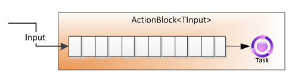

Chapter 19-Agent-Based Programming
=========================================

```C#
public static class Agent
{
    public static Agent<Msg> Start<State, Msg>(State initialState, Func<State, Msg, State> process)
    {
        return new StatefulAgent<State, Msg>(initialState, process);
    }

    public static Agent<Msg> Start<Msg>(Action<Msg> action)
    {
        return new StatelessAgent<Msg>(action);
    }
}

//------------------------------------V
public class StatefulAgent<State, Msg> : Agent<Msg>
{
    private State state;
    private readonly ActionBlock<Msg> actionBlock;

    public StatefulAgent(State initialState, Func<State, Msg, State> process)
    {
        state = initialState;

        actionBlock = new ActionBlock<Msg>(msg =>
        {
            State newState = process(state, msg);
            state = newState;
        });
    }

    public void Tell(Msg message) => actionBlock.Post(message);
}
//------------------------------------Ʌ

//-------------------------------------------V
public class StatelessAgent<Msg> : Agent<Msg>
{
    private readonly ActionBlock<Msg> actionBlock;

    public StatelessAgent(Action<Msg> process)
    {
        actionBlock = new ActionBlock<Msg>(process);
    }

    public StatelessAgent(Func<Msg, Task> process)
    {
        actionBlock = new ActionBlock<Msg>(process);
    }

    public void Tell(Msg message) => actionBlock.Post(message);
}
//-------------------------------------------Ʌ

//------------------------------------->>
public sealed class ActionBlock<TInput> : IDataflowBlock, ITargetBlock<TInput>
{
   public ActionBlock(Action<TInput> action);
   public ActionBlock(Func<TInput, Task> action);  // <----------------------used by StatefulAgent which await RatesApi.GetRateAsync
   // ...
   public bool Post(TInput item);
}
//-------------------------------------<<
```

## Example 1: Getting Started with Agents

```C#
public static void Main(string[] args)
{
    Agent<string> logger = Agent.Start((string msg) => Console.WriteLine(msg));

    logger.Tell("Agent X");

    Agent<string> ping, pong = null;

    ping = Agent.Start((string msg) =>
    {
        if (msg == "STOP")
            return;

        logger.Tell($"Received '{msg}'; Sending 'Ping'");
        Task.Delay(1000).Wait();
        pong.Tell("PING");
    });

    pong = Agent.Start(0, (int count, string msg) =>
    {
        int newCount = count + 1;
        string nextMsg = (newCount < 5) ? "PONG" : "STOP";

        logger.Tell($"Received '{msg}' #{newCount}; Sending '{nextMsg}'");
        Task.Delay(500).Wait();
        ping.Tell(nextMsg);

        return newCount;
    });

    ping.Tell("START");

    Console.ReadLine();
}

/*
Received 'START'; Sending 'PING'
Received 'PING' #1; Sending 'PONG'
Received 'PONG'; Sending 'PING'
Received 'PING' #2; Sending 'PONG'
Received 'PONG'; Sending 'PING'
Received 'PING' #3; Sending 'PONG'
Received 'PONG'; Sending 'PING'
Received 'PING' #4; Sending 'PONG'
Received 'PONG'; Sending 'PING'
Received 'PING' #5; Sending 'STOP'
*/
```

## Example 2: Handle concurrent requests

```C#
using CcyAgents = ImmutableDictionary<string, Agent<string>>;  // if you refer to Chapter 15: Rates = System.Collections.Immutable.ImmutableDictionary<string, decimal>
                                                               // so Rates is a cache, but if we had a different cache for every thread, that would be suboptimal.
                                                               // that's why we use agents to make a single global cache
public static class Program_CurrencyLookup
{
    public static void Main(string[] args)
    {
        Agent<FxRateResponse> sendResponse = Agent.Start((FxRateResponse res) => Console.WriteLine($"{res.CcyPair}: {res.Rate}"));

        Agent<FxRateRequest> rateLookup = StartReqProcessor(sendResponse);

        Parallel.ForEach(Range(1, 1000), i => rateLookup.Tell(new FxRateRequest(i % 2 == 0 ? "EURUSD" : "GBPUSD", i % 2 == 0 ? "ServiceA" : "ServiceB")));

        Task.Delay(10000).Wait();
    }

    public static void Setup(MessageBroker broker)
    {
        Agent<FxRateResponse> sendResponse = Agent.Start((FxRateResponse res) => broker.Send(res.Recipient, res));

        Agent<FxRateRequest> processRequest = StartReqProcessor(sendResponse);

        // processRequest.Tell will be called on multiple threads by multiple services who post message on this channel
        broker.Subscribe<FxRateRequest>("FxRateRequests", processRequest.Tell);  // when a request is received, pass it to the processing agent
                                                                                 // here we go from multithreaded to sequential
    }

    // Agent<FxRateRequest> should not do long processing work, so it doesn't have any `await` and it just posts message to Agent<string> agent which uses `await`
    public static Agent<FxRateRequest> StartReqProcessor(Agent<FxRateResponse> sendResponse)
    {
        return Agent.Start(CcyAgents.Empty, (CcyAgents state, FxRateRequest request) =>
        {
            string ccyPair = request.CcyPair;

            Agent<string> agent = state.Lookup(ccyPair).GetOrElse(() => StartAgentFor(ccyPair, sendResponse));

            agent.Tell(request.Sender);

            return state.Add(ccyPair, agent);
        });
    }

    public static Agent<string> StartAgentFor(string ccPair, Agent<FxRateResponse> sendResponse)
    {
        return Agent.Start<Option<decimal>, string>  // public class StatefulAgent<State, Msg> where State is Option<decimal>, Msg is string
        (
            initialState: None,
            process: async (optRate, recipient) =>
            {
                decimal rate = await optRate.GetOrElse(() => RatesApi.GetRateAsync(ccPair));

                sendResponse.Tell(new FxRateResponse
                (
                    CcyPair: ccPair,
                    Rate: rate,   // <----------this is what we want in response
                    Recipient: recipient
                ));

                return Some(rate);
            }
        );
    }
}

//--------------------------------------------------------------------------->>
public rec൦rd FxRateRequest(string CcyPair, string Sender);

public rec൦rd FxRateResponse(string CcyPair, decimal Rate, string Recipient);
//---------------------------------------------------------------------------<<

//------------------------V
public class MessageBroker
{
    ConnectionMultiplexer redis = ConnectionMultiplexer.Connect("localhost");

    public void Subscribe<T>(string channel, Action<T> act)
        => redis.GetSubscriber().Subscribe(channel, (_, val) => act(JsonConvert.DeserializeObject<T>(val)));

    public void Send(string channel, object message)
        => redis.GetDatabase(0).PublishAsync(channel, JsonConvert.SerializeObject(message));
}
//------------------------Ʌ
```

you might ask why we need to introduce an extra agent "layer" `Agent<string>`, this is because the internal structure of `ActionBlock`



If you let `Agent<FxRateRequest>` to handle all the processings by letting services to call its `Tell` method which queues a work item which can be processed asynchronously (work item is abstracted as `Task`). Note that it still exeuctes work items sequentially even through it does execute work items asynchronously. This is a classic exmaple that shows asynchronous programming is not multi-threading programming. In this example's scenario, let's say there are two services post messages to the `Agent<FxRateRequest>` and this agent does all the processing, then it is single-threaded, and we lose any benefit of multithreading, so if ServiceA posts a message to get "EURUSD" and ServiceB post a message to get "USDCHN", although requests are received on multiple threads, they'll be immediately queued up in the processing agent's inbox and processed `sequentially`, which processes ServiceA's request first, then ServiceB's request.

That's why we introduce an extra agent layer `Agent<string>` to simulate multi-threading


## Rework this chapter after revisit CLR via C#